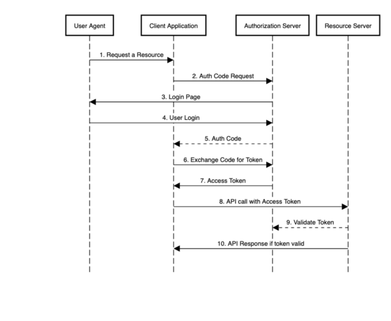

OAuth Server Demo

## 시퀀스



## 기능 명세

### 0. 회원가입
* 자체 회원가입 요청 api
```
curl -X POST \
  http://localhost:8080/join \
  -H 'cache-control: no-cache' \
  -H 'content-type: application/json' \
  -d '{ "email":"{id로 사용 이메일}", "password":"{패스워드}"}'
```
* 소셜 로그인 통한 회원 가입
  * 웹브라우즈에서 아래 url 접근 후 로그인 페이지에서 Login with OAuth2.0 아래 있는 소셜 플랫폼 로그인 진행
  * 소셜 로그인 후 /oauth2_join에서 회원가입 처리 됨
```
http://localhost:8080/api/test/home
```
### 1. authorization_code 방식의 인증 처리
* 웹브라우저에서 아래 url 접근
```
http://localhost:8080/oauth/authorize?client_id=testapp&redirect_uri=http://localhost:8080/oauth2/callback&response_type=code&scopes=read,profile
```
  - 
### 2. Password Credentials Grant 방식의 인증 처리
* 아래 api로...
```  
curl testapp:123456@localhost:8080/oauth/token -dgrant_type=password -dscope=read -d username=test0001@gmail.com -d password=abcd1234
``` 

### 3. 토큰 갱신
```
curl -X POST \
  http://localhost:8080/oauth2/token/refresh \
  -H 'cache-control: no-cache' \
  -H 'content-type: application/json' \
  -d '{"refreshToken":"{로그인시 발급 받은 리플래시 토큰}"}'
```

### 4. 토큰 삭제(로그아웃)
```
curl -X POST \
  http://localhost:8080/revoke_token \
  -H 'cache-control: no-cache' \
  -H 'content-type: application/json' \
  -d '{"access_token": "{로그인 발급 받은 access token}", "refresh_token": "{로그인 발급받은 refresh 토큰}"}'
```

### 5. Authentication 내용 볼수 있는 api
